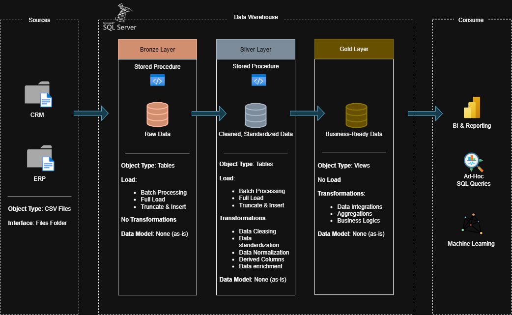
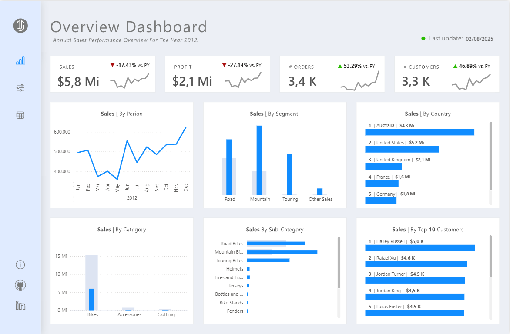

# SQL to Power BI Project

Welcome to this portfolio project! 🚀

This end-to-end solution demonstrates my ability to design and implement a complete data pipeline from SQL-based data modeling and data warehouse development to interactive dashboard creation in Power BI.
It follows industry best practices in data engineering, modeling (star schema), and business intelligence, with a focus on delivering insights that support decision-making.
The goal is to showcase my technical skills and analytical thinking in real-world business scenarios.

---
## 🏗️ Data Architecture

The project applies the Medallion Architecture framework organizing data across *Bronze*, *Silver*, and *Gold* layers to ensure scalability, quality, and clarity throughout the pipeline:

1. **Bronze Layer**: Stores raw, unprocessed data ingested from CSV files into a SQL Server database.
2. **Silver Layer**: Applies data cleansing, normalization, and standardization, preparing data for reliable downstream use.
3. **Gold Layer**: Contains curated, business-ready data modeled in a star schema, optimized for reporting and analytics.

---
## 📖 Project Overview

This project showcases the full data lifecycle, combining technical execution with strategic thinking:

1. **Modern Data Architecture**: Designing and implementing a Medallion-based warehouse to organize and govern data effectively.
2. **ETL Development**: Building robust ETL processes to extract, transform, and load data into the SQL Server database.
3. **Dimensional Modeling**: Creating fact and dimension tables following star schema principles for performance and usability.
4. **Data Analysis & Reporting**: Delivering actionable insights through Power BI dashboards supported by DAX measures and SQL queries.

---
## 📊 Key Insights & Recommendations
After processing and modeling the data, I developed an interactive Power BI dashboard to identify trends, monitor KPIs, and uncover improvement opportunities.

Key Insights
• Operational Bottlenecks: Certain processes or segments presented higher lead times, impacting overall performance.

• Data Quality Gaps: Missing or inconsistent values in key fields could affect the accuracy of reporting.

• High Variability in Performance: Significant differences between periods, suggesting external factors or inefficiencies.

Recommendations & Possible Solutions
• Process Optimization: Review and streamline workflows in underperforming segments to reduce delays.

• Data Governance: Implement validation rules and monitoring processes at the ingestion stage to improve data reliability.

• KPI Standardization: Establish baseline targets to better measure progress and support decision-making.

This dashboard not only provides visibility into the current state but also serves as a strategic tool for continuous improvement.

